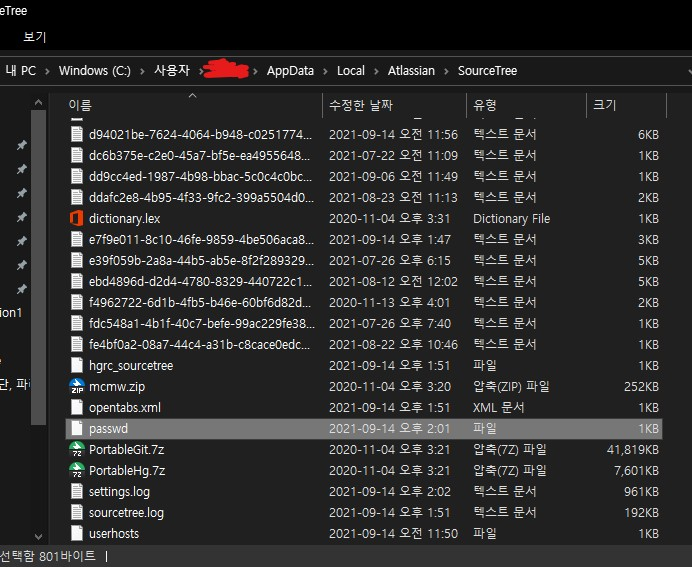

소스트리로 git이나 그 외 저장소(space, etc....)를 접근할때 아이디와 비밀번호를 입력해야한다.
이후 변동이 없으면 괜찮지만 21.08.13 github의 정책이 개인 비밀번호 대신 토큰으로 접근하도록 변경되었다.
하지만 소스트리는 비밀번호를 다시 입력하게 해주지 않기 때문에 이번 블로그는 이러한 문제를 해결하고자 작성한다.

## 1. passwd파일 삭제

- `C:\Users\{사용자이름}\AppData\Local\Atlassian\SourceTree\` 경로 이동
- passwd 파일 삭제

## 2. 파일 삭제후 push를 하면 다시 비밀번호 입력하라는 창이뜨고 그때 기존 git계정 비밀번호 대신 토큰을 입력하면 된다.
