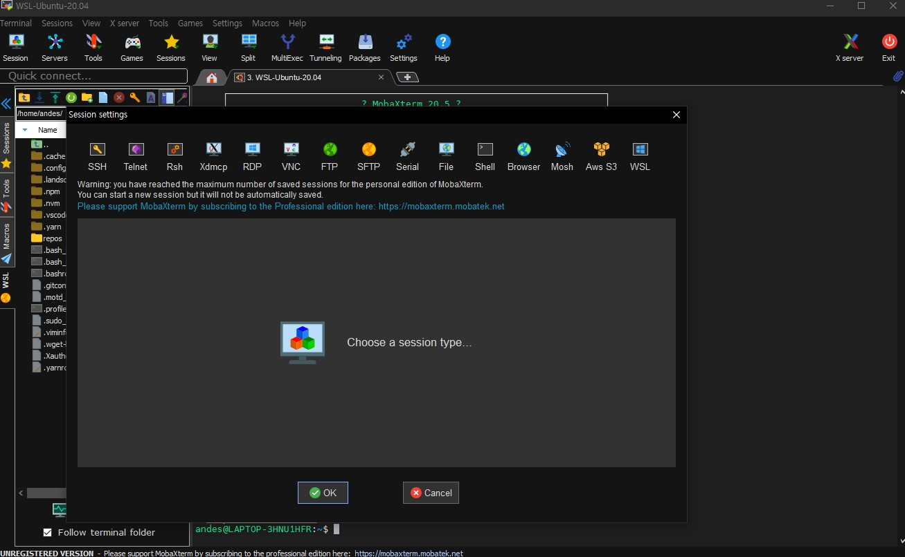
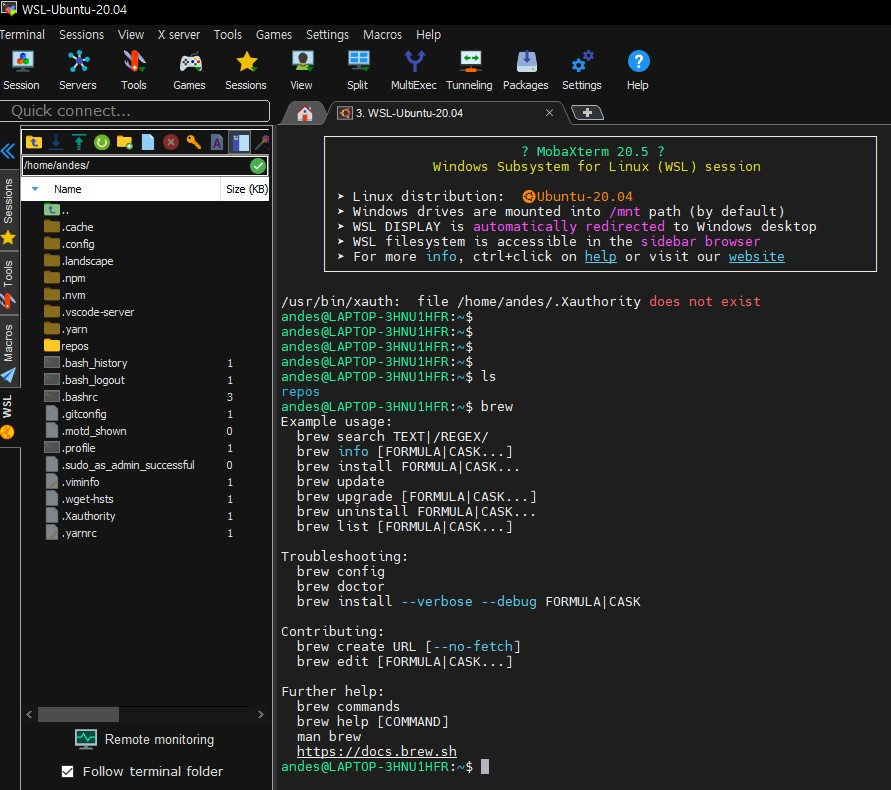
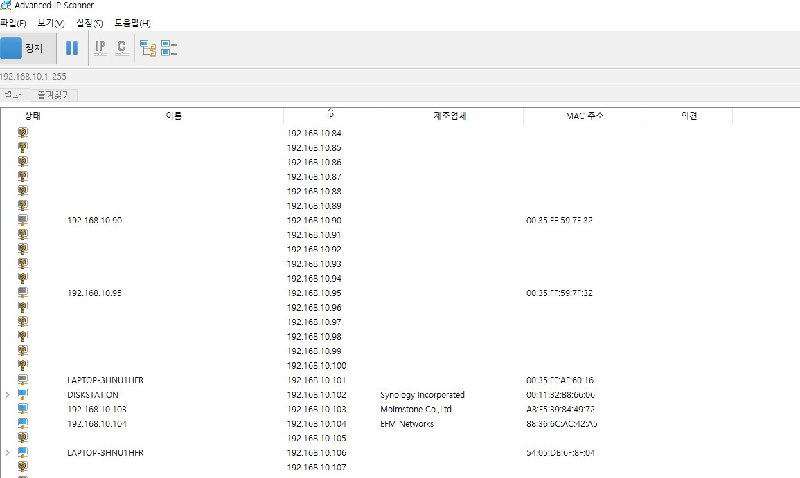
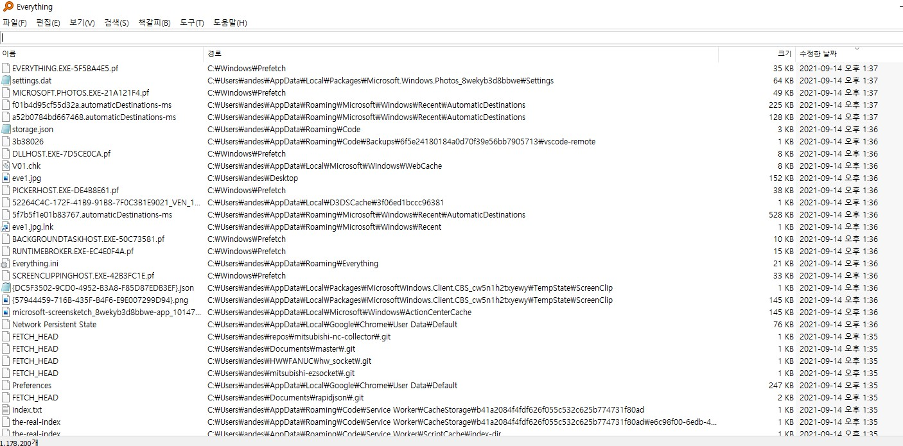

개발을 하다보면 다양한 툴을 사용한다. 현재 이용하는 툴은 많지만 그 중 몇가지 자주 쓰는 툴을 추천한다. (라이센스는 모두 프리웨어입니다.)

## 1. mobaxterm

- 다양한 원격 접속 방법 지원 (SSH, Telnet, Rsh, FTP, SFTP, wsl, etc......)

- 드래그&드랍을 이용한 간편한 파일 업/다운로드

## 2. Advanced Ip Scanner

- 직관적인 화면 및 다양한 정보 확인 가능, 쉬운 사용법

## 3. Everything

- 쉬운 사용법, 기존 탐색기 파일 찾기보다 훨씬 빠른 속도

여기 나열한 툴보다 더 기능이 많고 좋은것들이 많지만 이러한 툴들이 있고 마땅히 쓸게 없으면 한번쯤 써보는걸 추천한다.
