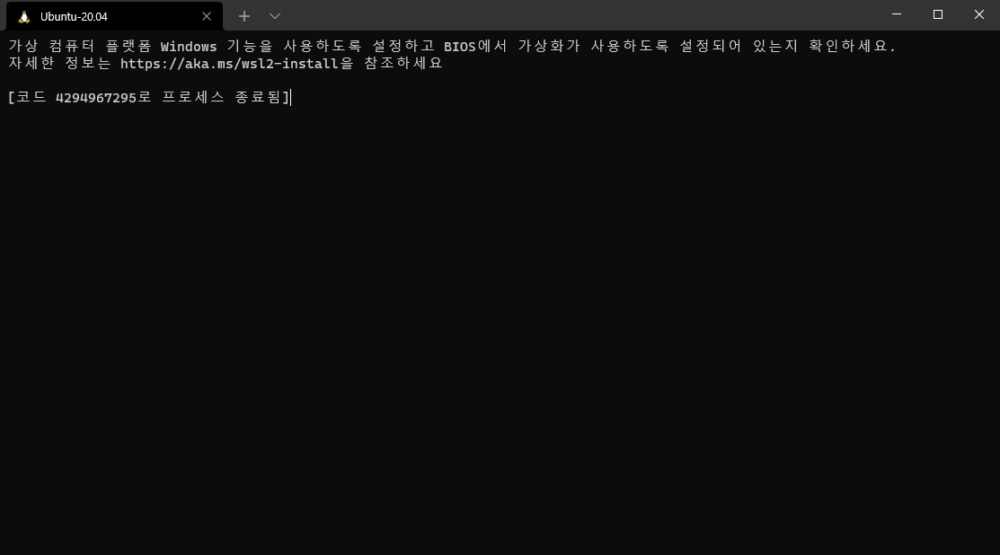

virtualbox wsl2 충돌피하는 법

1. wsl 종료

- cmd 관리자 모드로 실행

- `bcdedit /set hypervisorlaunchtype off` 명령어 실행

- 재부팅

- 이후 wsl 실행시 아래와 같은 화면이 나오면 wsl이 꺼진것

2. wsl 시작

- 마찬가지로 cmd 관리자 모드로 실행

- `bcdedit /set hypervisorlaunchtype auto` 명령어 실행

- 재부팅

- 이후 wsl을 켜서 정상동작 되는지 확인

※혹시 다시 켜도 위의 사진이 아닌 첫번째 사진처럼 나온다면

- powerShell 관리자모드로 실행

- `dism.exe /online /enable-feature /featurename:VirtualMachinePlatform /all /norestart` 명령어 실행 후 재부팅

- wsl 켜서 정상동작 확인.
