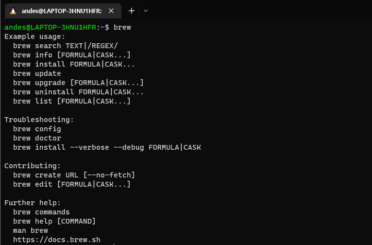

## 1. Homebrew란?


- 터미널에서 명령을 실행하는 것만으로, 패키지 설치 및 제거가 용이하게 할 수있게 해주는 패키지 관리 도구
- `brew install aaa bbb ccc`

## 2. 설치 방법

- wsl2 설치하기(설치 필수): [윈도우 Wsl2 설치방법][install_link]
  [install_link]: <https://docs.microsoft.com/ko-kr/windows/wsl/install> "go wsl"

- brew 설치 및 환경 변수 등록

  ```
  // 설치
  $ /bin/bash -c "$(curl -fsSL https://raw.githubusercontent.com/Homebrew/install/HEAD/install.sh)"

  // 환경변수 등록

  $ test -d ~/.linuxbrew && eval $(~/.linuxbrew/bin/brew shellenv)
  $ test -d /home/linuxbrew/.linuxbrew && eval $(/home/linuxbrew/.  linuxbrew/bin/brew shellenv)
  $ test -r ~/.bash_profile && echo "eval \$($(brew --prefix)/bin/brew  shellenv)" >>~/.bash_profile
  $ echo "eval \$($(brew --prefix)/bin/brew shellenv)" >>~/.profile
  ```

## 3. 설치 확인


