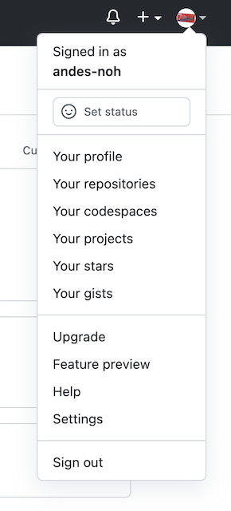
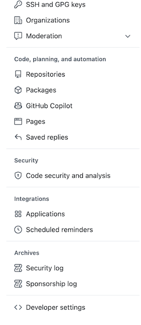
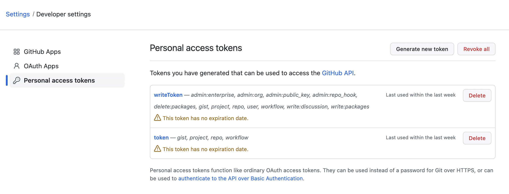
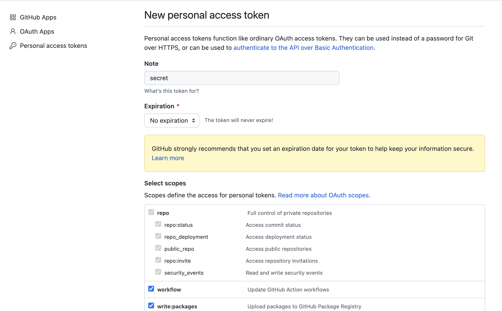
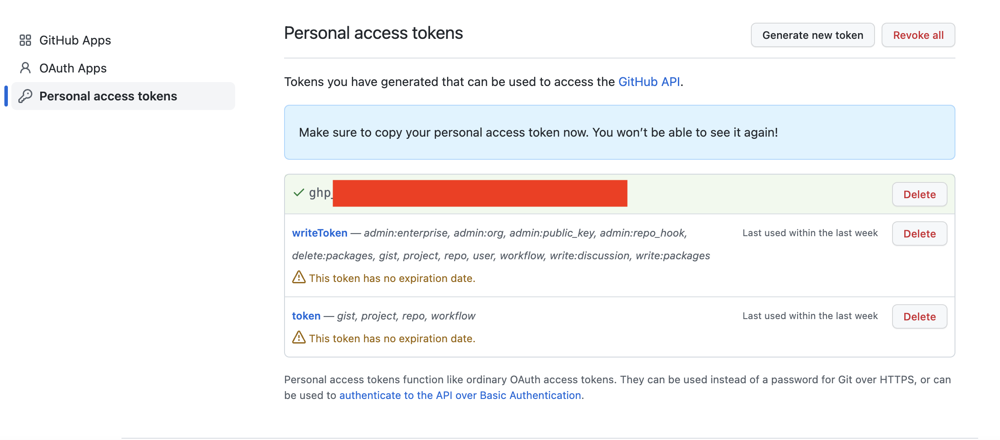
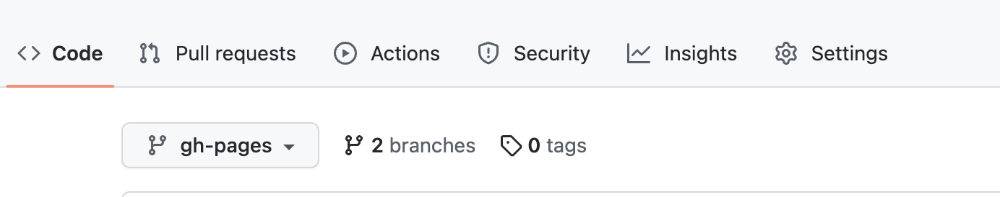
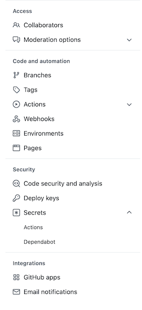
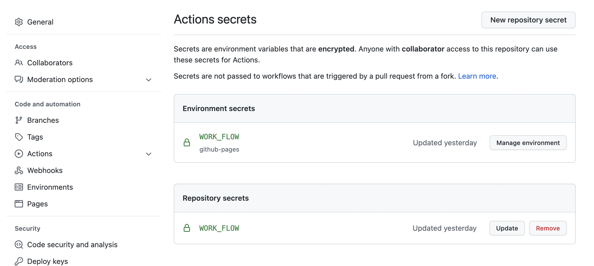
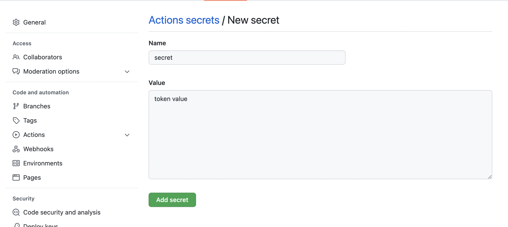
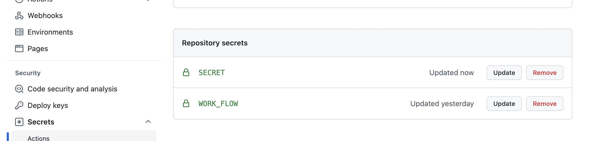

github action을 이용한 CI/CD를 위해 yml파일에 민감한 정보가 필요한 경우(token) 어떻게 등록하는지 알아보자

## 1. github action에서 사용할 토큰 발행 방법

- ### settings 클릭

  

- ### Developer settings 클릭

  

- ### Generate new token 클릭

  

- ### token 사용 용도(Note), 만료 기간(Expiration), 범위(Scopes) 설정

  

- ### token 생성
  

## 2. Repository settings

- ### token을 등록할 repo로 이동후 setting 클릭

  

- ### 왼쪽바의 Secret - Actions 클릭

  

- ### New Repository Secret 클릭

  

- ### 이름 및 token 등록

  

- ### 등록완료
  
