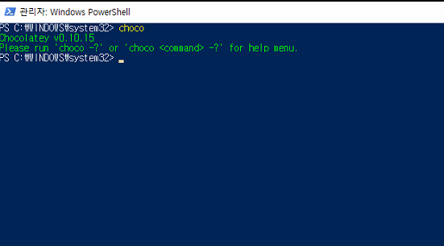
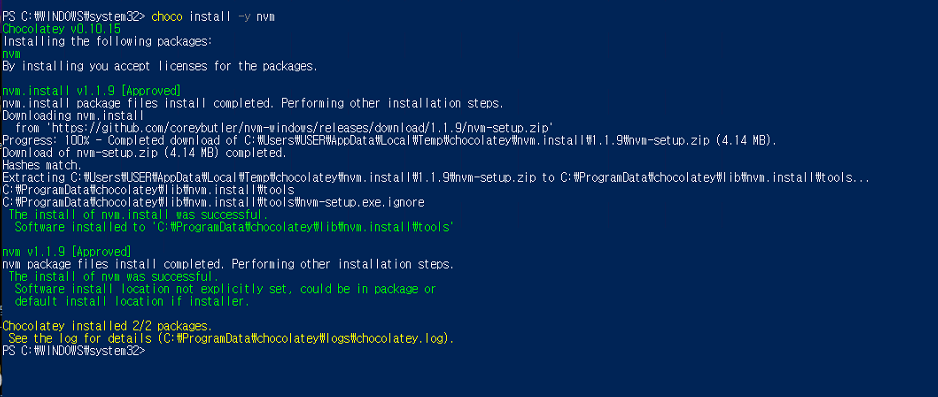
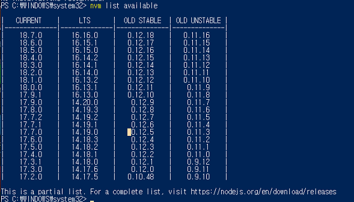
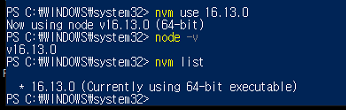
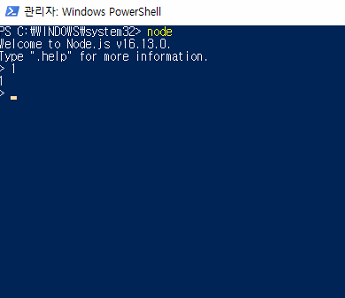

## 1. chocolatey란?

- 리눅스의 apt, 맥의 honebrew와 같은 윈도우용 패키지 관리 도구
- `choco install aaa bbb ccc`
- 참고 링크: [chocolatey][link]
  [link]: <https://chocolatey.org/> "chocolatey"

## 2. choco 설치 방법

- 관련 링크: [윈도우 choco 설치방법][install_link]
  [install_link]: <https://chocolatey.org/install#non-administrative-install> "choco install link"

- ### ※주의 사항
  - 원활한 설치를 위해서는 Power Shell을 관리자 모드로 실행할것
  - Power Shell 실행 정책(Execution Policy)으로 인해 Get-ExecutionPolicy 명령어 입력시 `Restrict` 라는 값이 나올경우
    `Set-ExecutionPolicy AllSigned` 혹은 `Set-ExecutionPolicy Bypass -Scope Process` 명령어를 실행해서 실행 정책을 바꾼후 설치 할것

## 3. choco 설치 확인

- `choco` 입력
  

## 4. nvm 설치하기

- `choco install -y nvm`
  

- 설치후 바로 적용이 안되기때문에 Power Shell 종료후 다시 관리자 모드로 실행후 `nvm` 설치 확인

## 5. node 설치하기

- `nvm list available` 명령어로 설치 가능한 node확인
  

- 원하는 버전의 node 설치
- 16.13.0 버전 설치 시 `nvm install 16.13.0`
- nvm use 명령어를 사용해 pc 에서 사용할 node 지정 `nvm use 16.13.0`
- 위의 방법을 통해 여러 버전의 node 설치 및 자유로운 사용 가능
  

## 6. node 설치 완료

## 7. 설치 패키지 삭제 (node 및 nvm)

- node 삭제: `nvm uninstall 16.13.0`
- nvm 삭제: `choco uninstall -y nvm`
