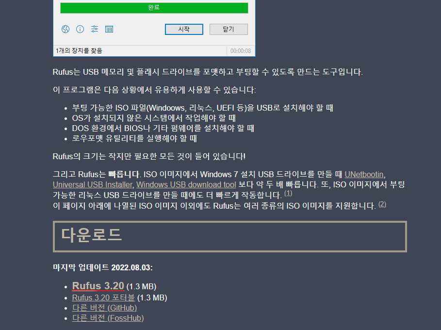
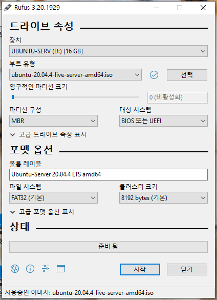
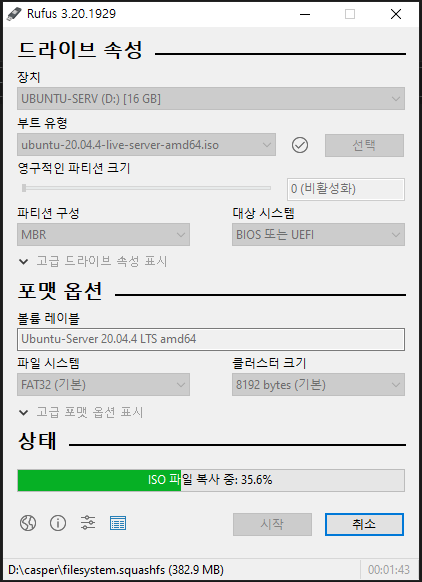
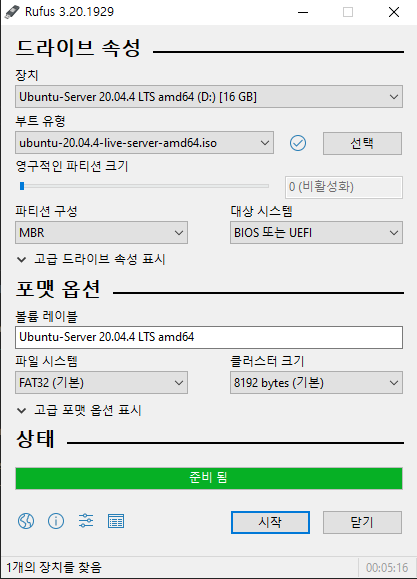
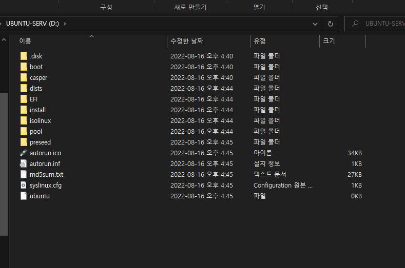

## 1. 준비물

- ### [rufus][link]

  [link]: https://rufus.ie/ko/ 'rufus'

  

- ### ubuntu iso file: [ubuntu][ubu]

  [ubu]: http://mirror.kakao.com/ubuntu-releases/20.04/ 'ubuntu 20.04'

- ### 최소 4GB 이상의 USB

## 2. 제작

- ### rufus 실행

- ### 다운 받은 iso 파일 선택 후 확인

  

- ### 시작 클릭

  

- ### 완료

  

## 3. 확인

