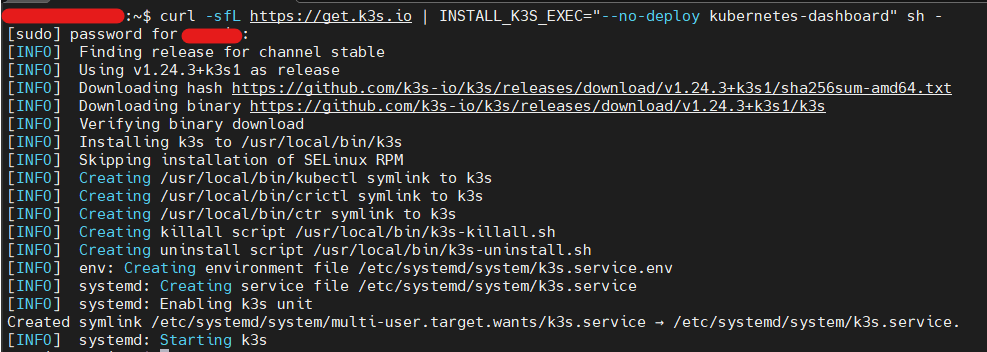

## 1. k8s 관련 기본 개념정리

---

- ### Image
  - application 실행에 필요한 최소한의 환경(런타임, 라이브러리)을 포함하고 있는 바이너리 파일
  - 컨테이너 실행에 필요한 파일과 설정 값을 포함하고 있는 것
  - Dockerfile이라는 파일을 통해 제작
- ### Container
  - 앱이 구동되는 환경까지 감싸서 실행할 수 있도록 하는 격리 기술
  - 호스트에서 돌아가고 있는 하나의 프로세스
  - 즉 위의 Image를 실행한 상태로 격리된 공간에서 프로세스를 동작 시키는 기술
  - 하나의 Image로 여러개의 컨테이너 생성 가능
- ### Docker
  - 컨테이너를 다루는 도구
  - 즉 컨테이너 런타임중 가장 유명한 플랫폼
  - push, pull, run 명령어등을 통해 이미지를 컨테이너에 띄우고 실행
- ### Kubernetes
  - Docker를 이용해 컨테이너를 분산 배치, 상태 관리, 구동 환경 관리 즉 오케스트레이션 하는 도구

## 2. k3s 설치

---

- ### 개념

  - 컨테이너 관련 기술을 개발하는 Rancher Labs에서 개발한 쿠버네티스
  - 기존 etcd 의존성을 없애고 sqlite를 기본으로 사용
  - 컨테이너 런타임으로 Docker을 대신해 containerd를 사용
  - 설치가 매우 간단
  - 단점으로는 기존 쿠버네티스에서 지원하는 과거 버전 API 미지원

- ### 설치 방법

  - `curl -sfL https://get.k3s.io | INSTALL_K3S_EXEC="--no-deploy kubernetes-dashboard" sh -`
  - 대쉬보드 설치 X 옵션 추가
  - 대쉬보드 관련해서는 다음 글에서 설명(`k9s`)

- ### 설치 완료
  
