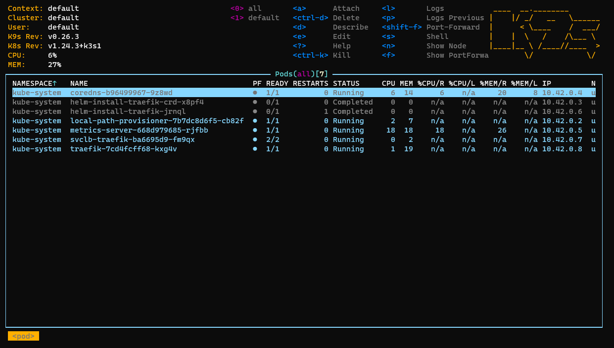

## 1. k9s란?

---

- ### 개념
  - 커맨드 라인 도구인 `kubectl`을 대신해서 쿠버네티스 클러스터를 제어할수 있는 터미널 기반 UI툴

## 2. k9s 설치

---

- ### k3s를 설치한 서버의 터미널창 오픈
- ### `brew install k9s`

  - [brew 설치 참고 링크][link]

  [link]: https://andes-noh.github.io/blog/windows%20wsl%20homebrew%20install 'brew'

## 3. k3s 살펴보기

- ### /etc/rancher/k3s/k3s.yaml 파일을 적당한 폴더로 이동 및 이름 변경
- ### 옮긴 파일의 소유자 변경
  - `sudo chown 'YOUR OWNER':'YOUR GROUP' 'FILE NAME'`
- ### `k9s --kubeconfig /YOUR DIRECTORY/YOUR FILE`
  
