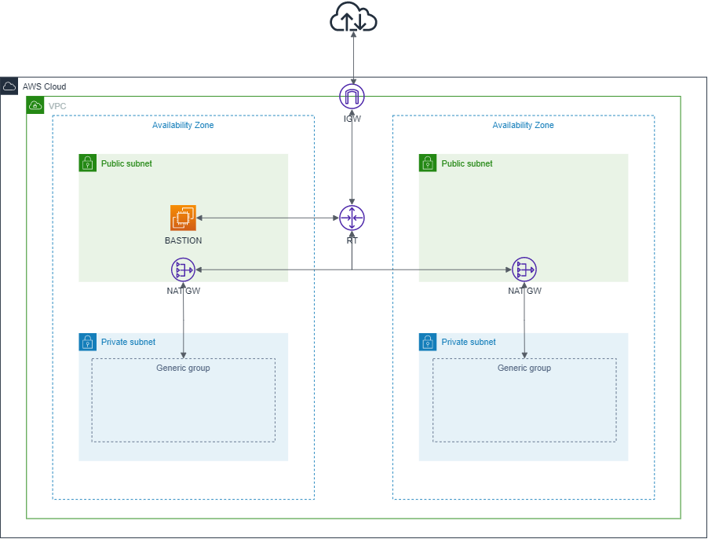
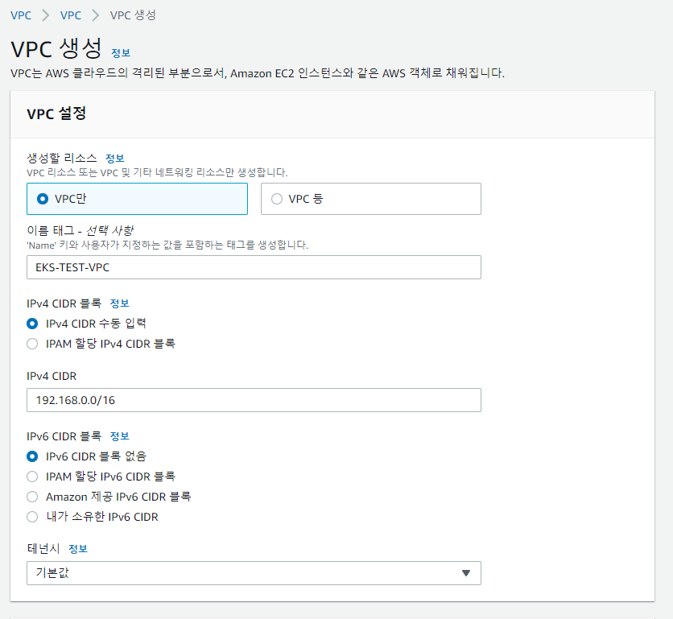
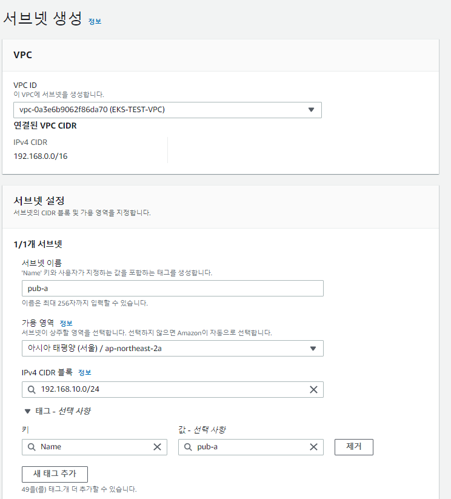
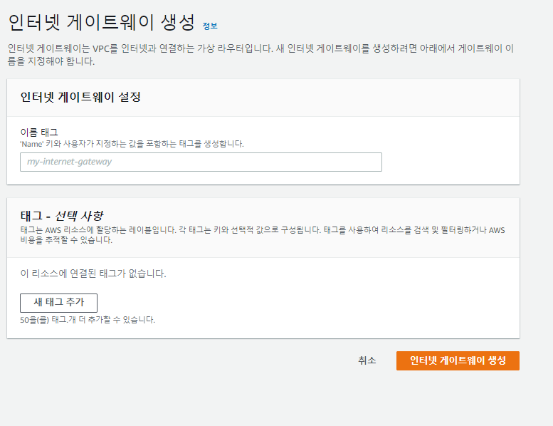
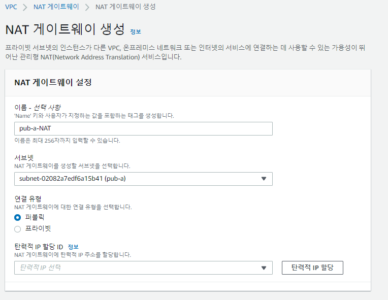
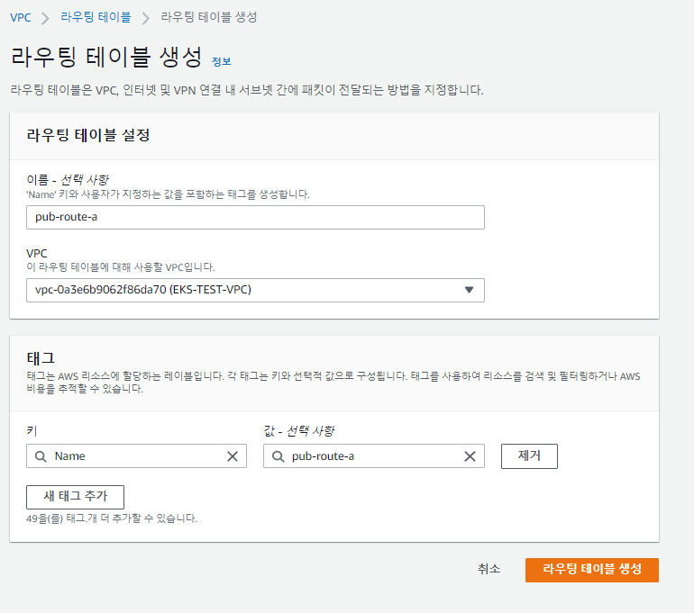
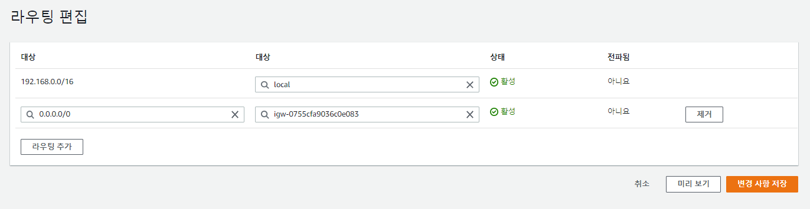

## 순서

- ### vpc 구성(1)
- ### eks cluster 생성
- ### worknode 생성 및 확인

## vpc 구성하기

- ### VPC(Virtual Private Cloud) 란

  - 사용자가 정의한 가상의 네트워크 환경
  - 정의한 네트워크 환경을 바탕으로 다양한 서비스 이용 가능
  - 가장 기본적인 vpc 구성도
    

#

- ### vpc 생성(무료)
  - IAM 로그인 -> vpc 검색 -> vpc 생성 클릭
  - 세팅
    
  - 이름태그: 원하는 이름태그 작성(ex: EKS-TEST-VPC)
  - IPv4 CIDR: VPC의 아이피 대역 지정(여기서는 192.168.0.0/16 대역 사용)
  - 생성

#

- ### 서브넷 생성(무료)

  - 좌측 메뉴 서브넷 클릭 -> 서브넷 생성 클릭
    
  - VPC ID: 기존 생성한 vpc 선택
  - 서브넷 이름: public 서브넷 2개, private 서브넷 2개 총 4개의 서브넷을 구분 가능하게 생성(ex: pub-a, pri-a, pub-c, pri-c)
  - 가용영역: 기본적인 구성도(AZ)참고, 이 글에서는 ap-northeast-2a와 ap-northeast-2c를 사용, 서브넷 이름 뒤의 알파벳이 AZ를 나타냄
  - IPv4 CIDR: 서브넷의 IPv4 지정, 기억 하기 쉽게 지정해야 확장시 혼란이 적음
    - pub-a: 192.168.10.0/24
    - pri-a: 192.168.11.0/24
    - pub-c: 192.168.20.0/24
    - pri-c: 192.168.21.0/24
  - **총 4개의 서브넷 생성**

#

- ### 인터넷 게이트웨이 생성(무료)
  - 인터넷 통신을 위한 GW
  - 좌측 메뉴 인터넷 게이트웨이 클릭 -> 인터넷 게이트웨이 생성 클릭
    
  - 이름태그: 원하는 이름태그 작성(ex: EKS-TEST-IGW)
  - **1개의 IGW 생성**

#

- ### NAT 게이트웨이 생성(유료: 만든 순간부터 과금, 테스트를 위해 만든다면 테스트후 삭제할것)

  - 외부와 통신이 안되는 private-subnet이 외부와의 통신을 위해 연결하는 GW
  - 좌측 메뉴 NAT 게이트웨이 클릭 -> NAT 게이트웨이 생성 클릭
  - 각 AZ 별로 생성
    
  - 이름 - 구분 가능하게 생성(라우팅 테이블 연결시 혼란 방지)
  - 서브넷: NAT GW를 생성할 서브넷 선택, private-subnet의 통신을 위해 만드는것이기때문에 혹시 private-subnet 안에 위치해야 한다고 생각할수 있지만 public-subnet에 위치해야 RT를 통해 통신 가능, 기존에 만든 ap-northeast-2a와 ap-northeast-2c의 public-subnet안에 각각 생성
  - 연결 유형: 퍼블릭
  - 탄력적 IP 할당 ID: 탄력적 IP 할당 클릭 해서 할당(한개의 탄력적 IP는 무료지만 2개이상부터는 과금 발생)
  - **총 2개의 NAT GW 생성**

#

- ### 라우팅 테이블 생성(무료)

  - 좌측 메뉴 라우팅 테이블 -> 라우팅 테이블 생성 클릭
  - 서브넷이 4개이므로 4개의 라우팅 테이블 필요
    
  - 이름: 원하는 이름 지정, 총 4개를 만들어야하므로 혼란 방지를 위해 구분가능하도록 설정
  - VPC: 기존에 만든 VPC 선택

  - **※라우팅 테이블 연결**
  - public subnet case

    - pub-a용으로 만든 라우팅 테이블 ID 클릭
    - 하단 라우팅 편집 클릭 -> 라우팅 추가 클릭 후 왼쪽 대상 0.0.0.0/0, 오른쪽 대상 인터넷 게이트웨이 선택 후 기존에 만든 게이트웨이 선택 후 변경사항 저장
      
    - 서브넷 연결 -> 명시적 서브넷 연결 -> 서브넷 연결 편집 클릭
    - pub-a 서브넷 체크 및 연결 저장
    - 명시적 서브넷 연결 확인
    - pub-c도 위와 같은 방식으로 연결

  - private subnet case

    - pri-a용으로 만든 라우팅 테이블 ID 클릭
    - 하단 라우팅 편집 클릭 -> 라우팅 추가 클릭 후 왼쪽 대상 0.0.0.0/0, 오른쪽 대상 NAT 게이트웨이 선택 후 ap-northeast-2a용으로 만든 NAT GW 선택 후 변경사항 저장
    - 서브넷 연결 -> 명시적 서브넷 연결 -> 서브넷 연결 편집 클릭
    - pri-a 서브넷 체크 및 연결 저장
    - 명시적 서브넷 연결 확인
    - pub-c도 위와 같은 방식으로 연결

  - public RT의 경우 라우팅에 같은 IGW 연결
  - private RT의 경우 라우팅에 각각 다른 NAT GW 연결

#

- ### Bastion 서버 구성

  - vpc -> 보안그룹 -> 보안그룹 생성
    - 보안 그룹 이름
    - 설명
    - VPC: 기존 EKS-TEST-VPC 선택
    - 인바운드 규칙 추가
      - 유형: ssh
      - 소스: 가장 좋은건 내 IP지만 다른 장소에서 로그인을 많이 할시 Anywhere 선택(어떤 ip로 접속하든 ssh 접속 가능)
    - 보안 그룹 생성

  #

  - ec2 검색 -> 인스턴스 시작
  - 이름 및 태그: Bastion
  - Amazon Linux 선택(프리티어 머신 이미지 선택)
  - 인스턴스 유형: t2.micro(프리티어)
  - 키페어: 새 키페어 생성 클릭 후 이름 입력 -> 생성
  - **네트워크 설정(편집)**
    - VPC: 기존 생성 VPC(EKS-TEST-VPC) 선택
    - 서브넷: pub-a 선택(pub-c도 상관없음)
    - 퍼블릭 IP 자동 할당: 활성화
    - 보안그룹: 기존 보안 그룹 -> 위에서 생성한 보안 그룹 선택
  - 인스턴스 시작

- ### Bastion 서버 연결

  - 인스턴스 ID 클릭
  - 연결 클릭
  - SSH 연결 클릭하여 인스턴스 생성시 다운 받은 .pem 파일과 함께 ssh 접속(putty, mobaxterm)
  - 리눅스나 맥으로 ssh 연결시 .pem 파일 권한 `chmod 600 ~.pem`으로 권한 변경 후 접속
  - Bastion 서버로 vpc내 다른 인스턴스에 접속 가능

- ### 기본 vpc 구성 완료
