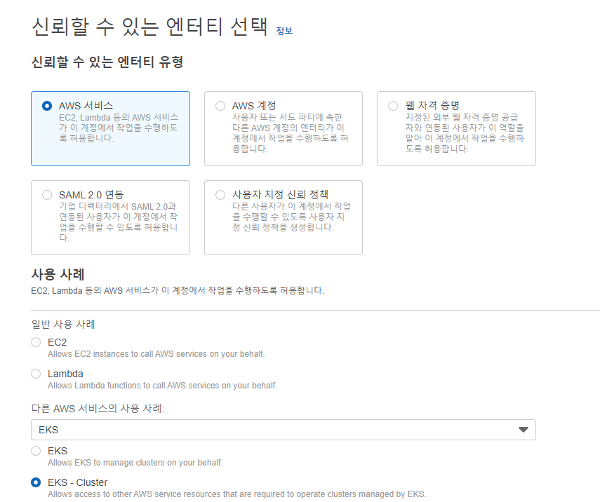
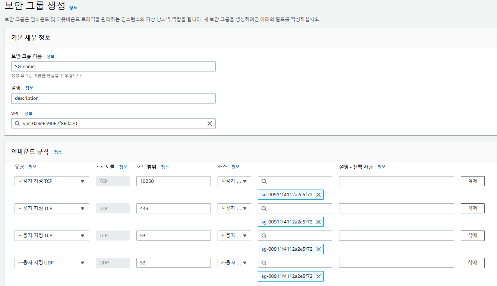
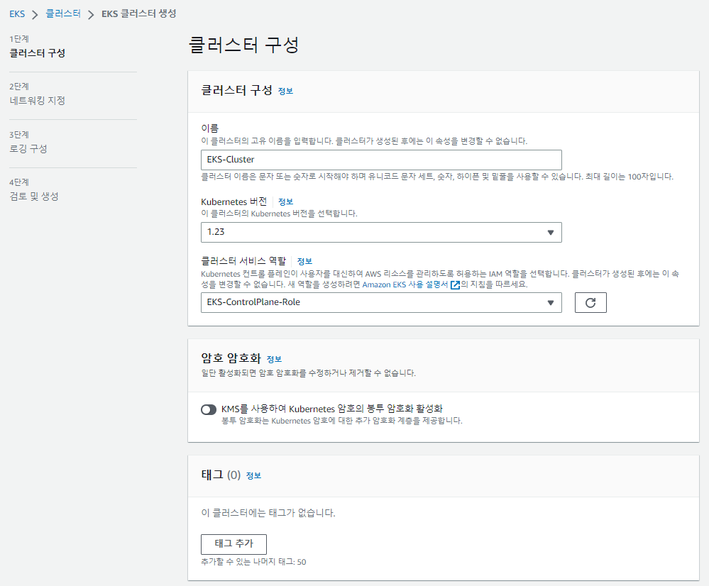
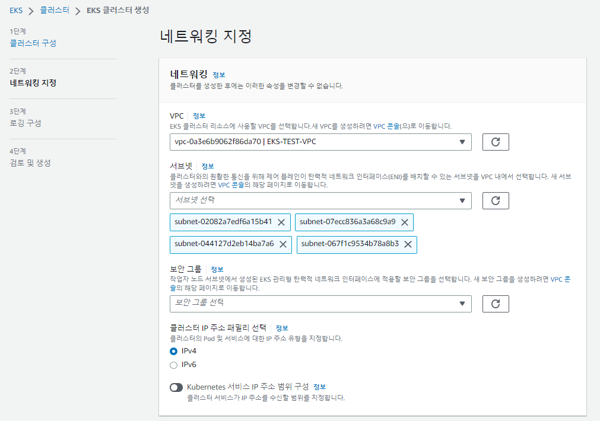
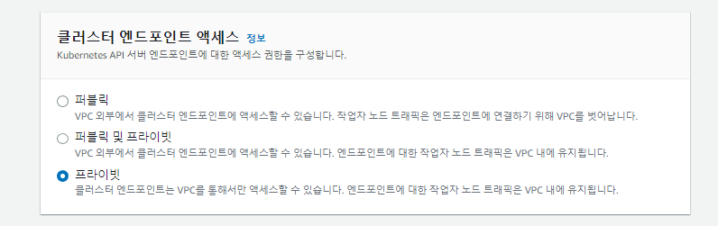
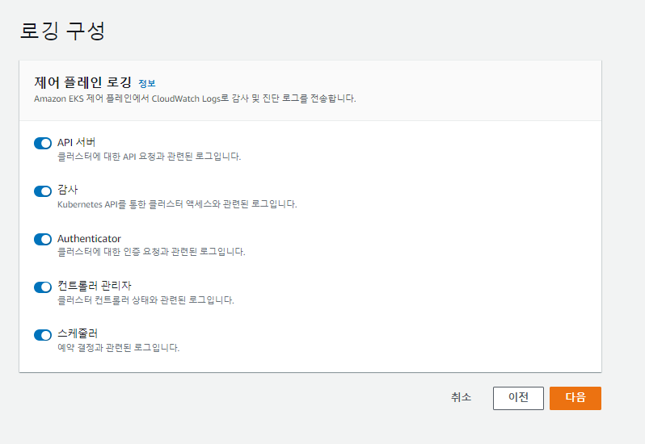

## 순서

- ### vpc 구성(1)
- ### eks cluster 생성(2) - ★
- ### worknode 생성 및 확인(3)

## eks cluster 생성

- ### 기존 VPC 구성도
  

#

- ### role 생성
  - IAM 로그인 -> IAM 검색 -> 역할(엑세스 관리) -> 역할 만들기
  - 사용 사례 EKS-Cluster 선택
    
  - 권한 추가 -> 다음
  - 이름 지정(EKS-ControlPlane-Role), 검토 및 생성 -> 역할 생성
  - 역할 생성 완료 확인
    

#

- ### 보안 그룹 생성
  - vpc 검색 -> 보안그룹 -> 보안 그룹 생성
    
    - 이름
    - 설명
    - VPC: EKS용 선택
    - 인바운드 규칙 추가: 사진과 같이 프로토콜 및 포트 지정(kubernetes 통신과 관련 있는 포트), 소스는 Bastion server 보안 그룹
      - TCP: 443
      - TCP: 10250
      - TCP: 53
      - UDP: 53
    - [Amazon EKS 보안 그룹 요구 사항 및 고려 사항](https://docs.aws.amazon.com/ko_kr/eks/latest/userguide/sec-group-reqs.html)

#

- ### eks 생성

  - eks 검색 -> 클러스터 추가 -> 생성
  - 클러스터 구성
    
    - 이름: EKS-Cluster
    - 버전: 기본
    - 서비스 역할: EKS-ControlPlane-Role
  - 네트워킹 지정
    
    - VPC: EKS-VPC
    - 서브넷: pub, pri 각각 2개씩 모두 선택(후에 private subnet에 존재하는 워크 노드들의 외부 통신을 대비해 public subnet도 포함해 클러스터 생성)
    - 보안 그룹: 위에서 생성한 보안 그룹 선택
  - 클러스터 엔드포인트 엑세스
    
    - 프라이빗 선택
  - 로깅 구성
    
  - 검토 및 생성 -> 생성

#

- ### eks 생성 완료
