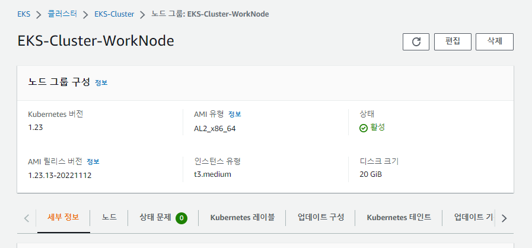
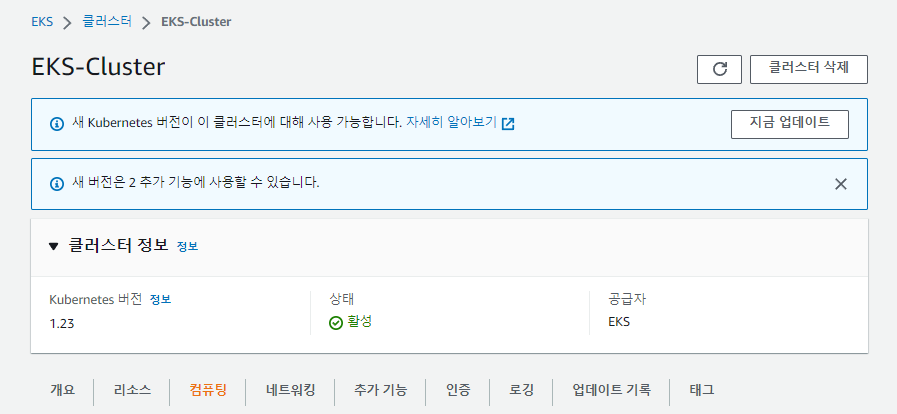

## 순서

- ### vpc 구성(1)
- ### eks cluster 생성(2)
- ### worknode 생성 및 확인(3)
- ### eks 삭제(4) - ★

## eks 삭제

- ### WorkNode 삭제

  - 삭제
    

#

- ### eks cluster 삭제
  - 삭제
    

#

- ### NAT GW 삭제 (요금 부과)
  - 총 2개

#

- ### 라우팅 테이블 private 라우팅 정리
  - NAT GW 삭제후 블랙홀로 변경됨 -> 삭제
  - 총 2개

#

- ### 탄력적 IP 삭제

  - NAT GW에 할당한 2개의 탄력적 IP 릴리스(요금 부과)
  - 인스턴스에 할당한 1개의 탄력적 IP는 요금 부과X

#

- ### 인스턴스 삭제
  - 프리티어인 경우 인스턴스가 t2.micro일 경우 요금이 부과되지않음(Bastion 서버를 micro로 만들었을시)
