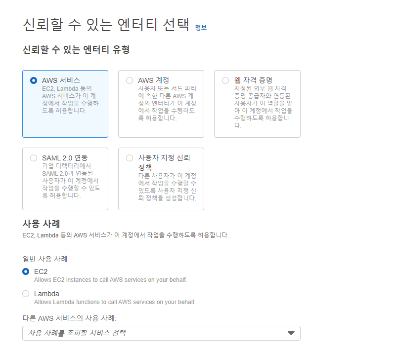
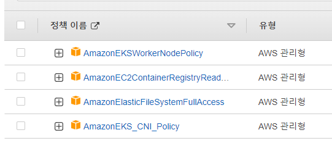
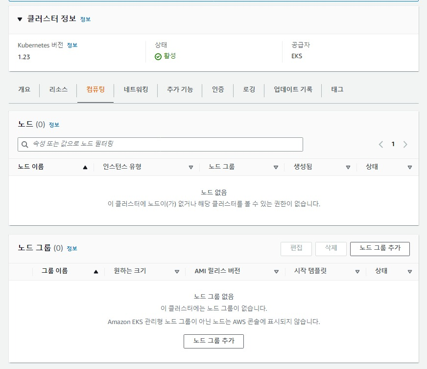
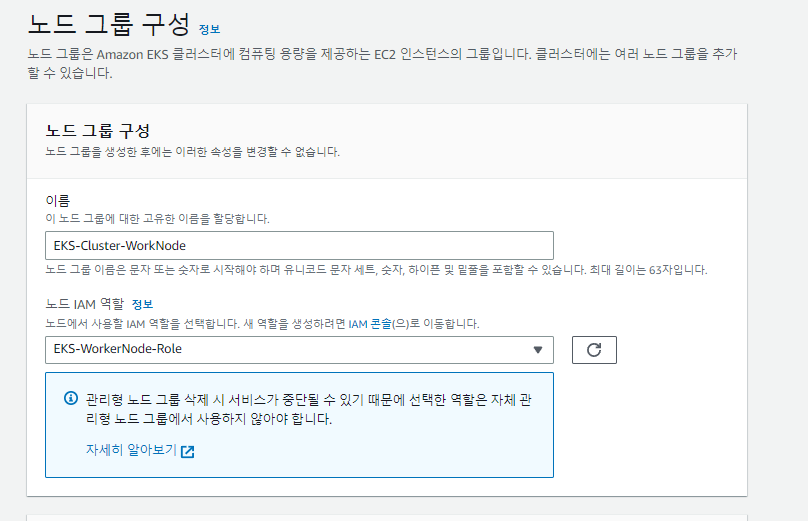
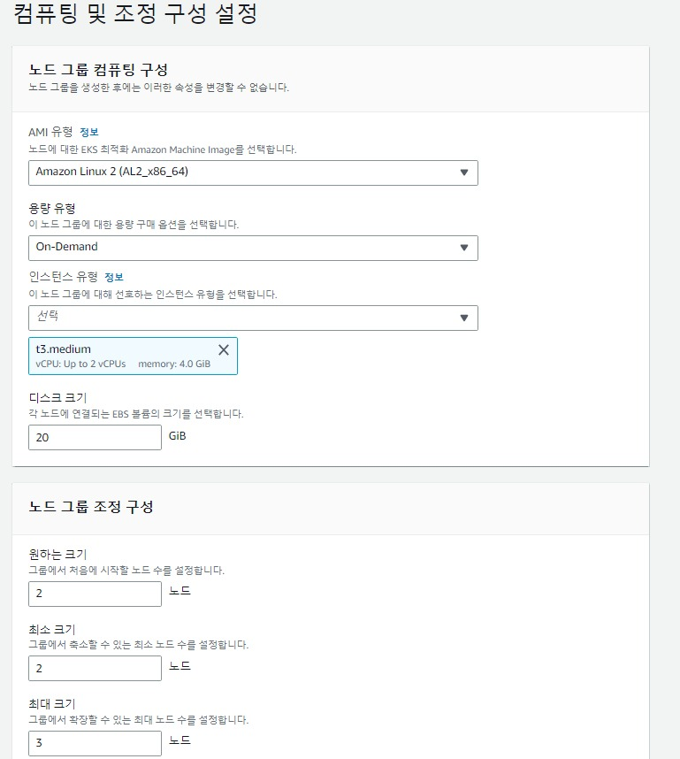
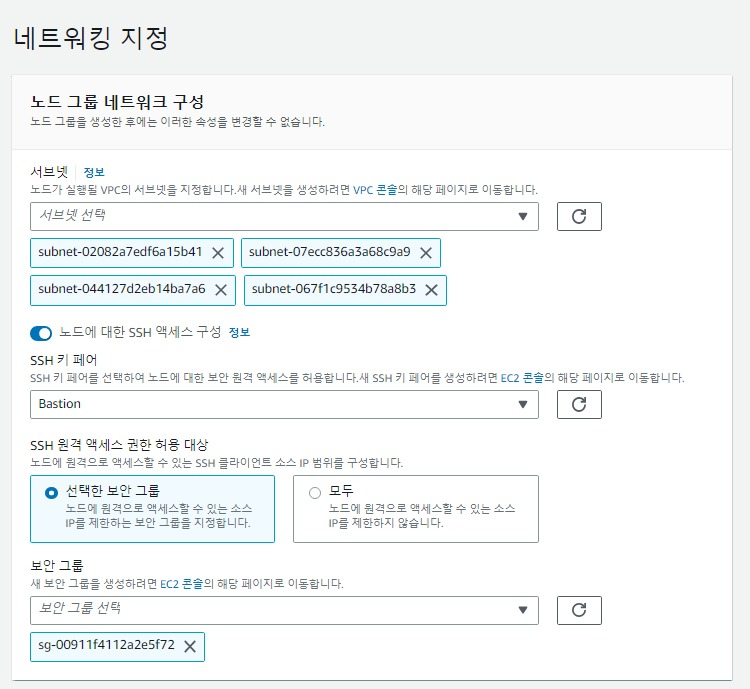
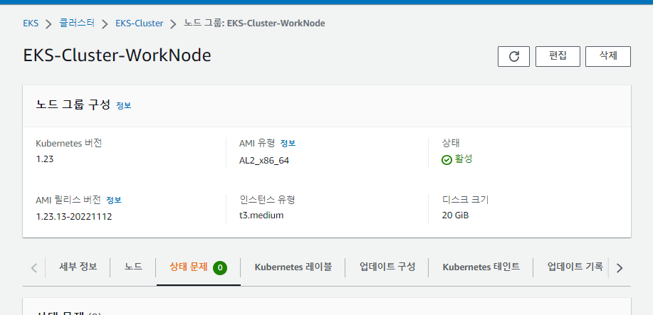
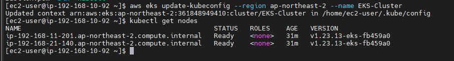

## 순서

- ### vpc 구성(1)
- ### eks cluster 생성(2)
- ### worknode 생성 및 확인(3) - ★

## worknode 생성 및 확인

- ### 노드 그룹용 role 생성

  - iam -> 역할 -> 역할 만들기
  - 세팅
    
  - 권한()
    
  - 역할 이름 확정 및 생성

#

- ### 노드 그룹 추가
  

#

- ### 노드 그룹 구성
  - 세팅
    
    - 이름 및 노드 그룹용 역할 선택
  - 다음

#

- ### 컴퓨터 및 조정 구성 설정

  - 세팅
    
  - 나머지 그대로, 노드 그룹 조정 크키의 최대 크기 2 -> 3으로 변경
  - 다음

#

- ### 네트워킹 지정
  - 세팅
    
  - 서브넷 -> private 서브넷 2개 선택
  - 노드에 대한 SSH 엑세스 구성 활성화
  - SSH 키페어 -> vpc 구성하면선 만든 Bastion 서버 키선택
  - 보안 그룹 -> Bastion-SG 선택
  - 위 과정을 통해 Bastion 서버에서 worknode로 ssh 접속 가능

#

- ### 생성 완료(수분 소요)

  - 생성완료
    

#

- ### Bastion 서버 접속 및 user 등록

  - ssh -i 'Bastion.pem' ec2-user@ip로 접속
  - `aws configure`로 user 등록

#

- ### kubectl 설치 및 확인

```
curl -o kubectl https://s3.us-west-2.amazonaws.com/amazon-eks/1.22.6/2022-03-09/bin/linux/amd64/kubectl
chmod +x ./kubectl
mkdir -p $HOME/bin && cp ./kubectl $HOME/bin/kubectl && export PATH=$PATH:$HOME/bin
echo 'export PATH=$PATH:$HOME/bin' >> ~/.bashrc
kubectl version --short --client

```

#

- ### eksctl 설치 및 확인

```
curl --silent --location "https://github.com/weaveworks/eksctl/releases/latest/download/eksctl_$(uname -s)_amd64.tar.gz" | tar xz -C /tmp
sudo mv /tmp/eksctl /usr/local/bin
eksctl version
```

#

- ### kubeconfig update

```
aws eks update-kubeconfig --region '지역이름' --name 'eks 클러스터 이름'
```

#

- ### 클러스터 및 노드 확인
  

#
