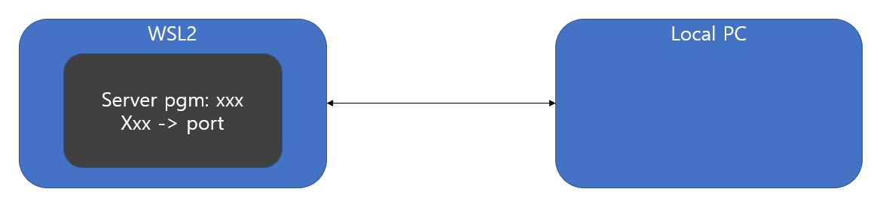

## 현상

- 
- wsl내부에서 서버 프로그램 or 포트포워딩을 통해 포트 개방
- 일반적으로 wsl과 local pc의 포트는 연결되지만 wsl에서만 포트가 열리고 local에서는 안되는 현상 발생
- 이러한 현상을 아래의 스크립트를 통해 단편적으로 해소 가능

#

## scripts

```
$remoteport = bash.exe -c "ifconfig eth0 | grep 'inet '"
$found = $remoteport -match '\d{1,3}\.\d{1,3}\.\d{1,3}\.\d{1,3}';

if( $found ){
  $remoteport = $matches[0];
} else{
  echo "The Script Exited, the ip address of WSL 2 cannot be found";
  exit;
}

#[Ports]

#All the ports you want to forward separated by coma
$ports=@(AAAA,BBB,CC,D);


#[Static ip]
#You can change the addr to your ip config to listen to a specific address
$addr='0.0.0.0';
$ports_a = $ports -join ",";


#Remove Firewall Exception Rules
iex "Remove-NetFireWallRule -DisplayName 'WSL 2 Firewall Unlock' ";

#adding Exception Rules for inbound and outbound Rules
iex "New-NetFireWallRule -DisplayName 'WSL 2 Firewall Unlock' -Direction Outbound -LocalPort $ports_a -Action Allow -Protocol TCP";
iex "New-NetFireWallRule -DisplayName 'WSL 2 Firewall Unlock' -Direction Inbound -LocalPort $ports_a -Action Allow -Protocol TCP";

for( $i = 0; $i -lt $ports.length; $i++ ){
  $port = $ports[$i];
  iex "netsh interface portproxy delete v4tov4 listenport=$port listenaddress=$addr";
  iex "netsh interface portproxy add v4tov4 listenport=$port listenaddress=$addr connectport=$port connectaddress=$remoteport";
}
```

- $ports=@(AAAA,BBB,CC,D) 위치에 로컬pc로 포트포워딩 하길 원하는 포트번호 입력

#

## 실행

- PowerShell 관리자 모드로 실행
- 스크립트 파일 위치 이동
- .\FILE_NAME 으로 파일 실행
- 일시적이지만 wsl과 local pc의 포트는 서로 열린다
